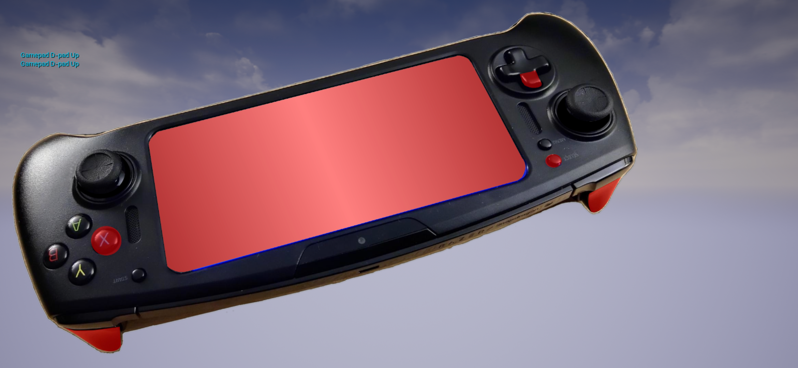
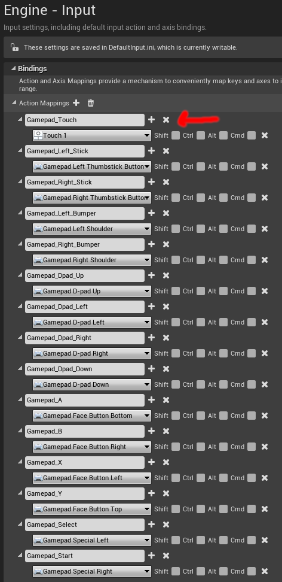
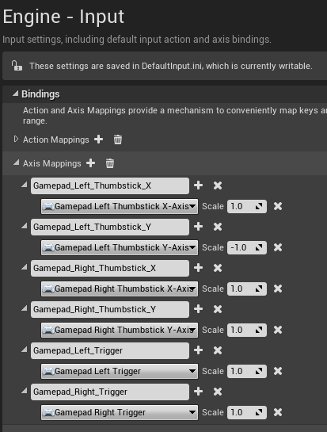
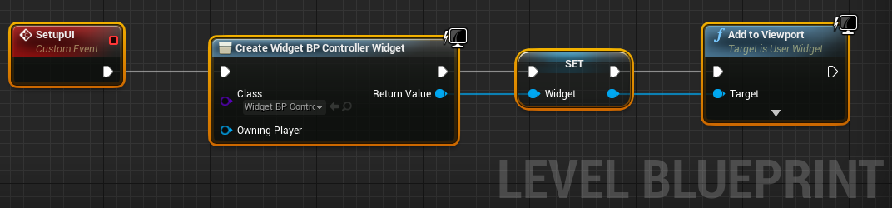
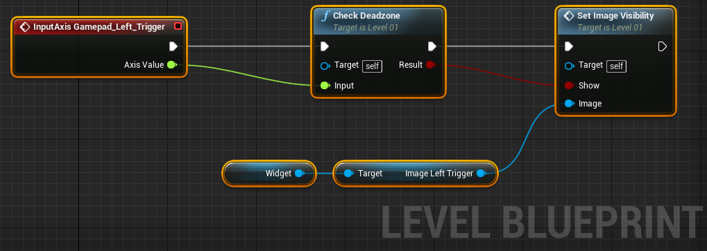
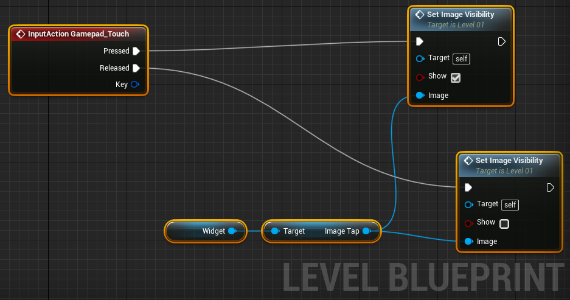
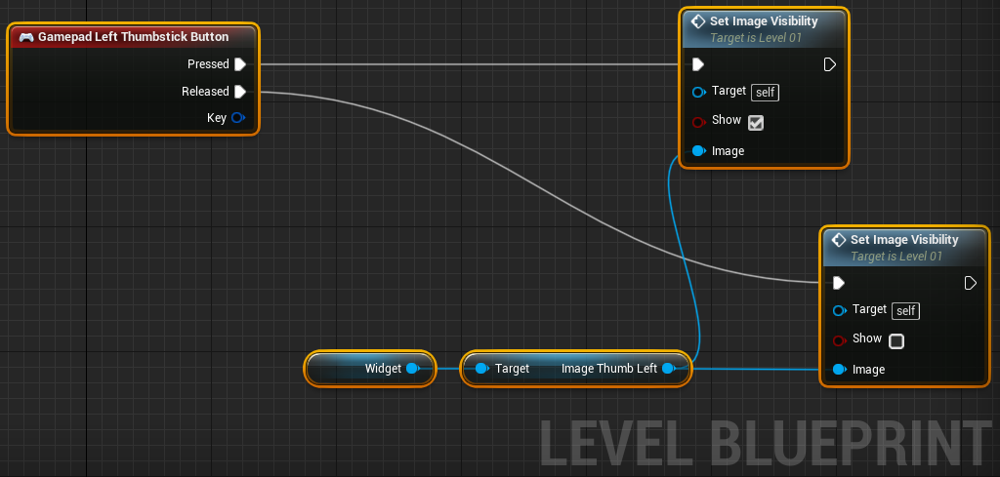
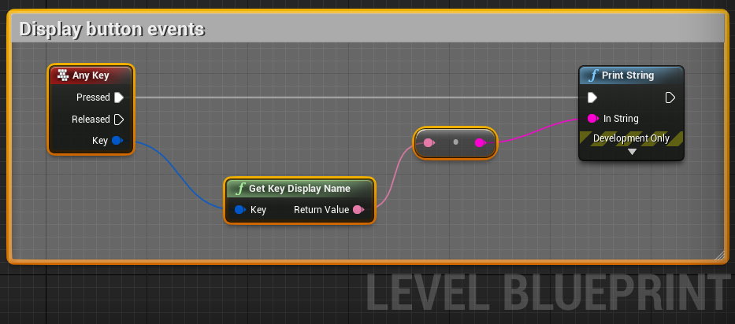

# UE4 Virtual Controller

* This input sample shows how to interact with the axises, buttons, and touch available on the developer kit.

* This sample project was created in UE 4.21.2.

* The touch and button inputs are defined by the `Project Settings` in the `Action Mappings` section. Notice: `Gamepad_Touch` uses `Touch 1` to detect the tap event.

* The axis inputs are defined by the `Project Settings` in the `Axis Mappings` section.

* The sample level can be found at [Level01.umap](Content\Levels\Level01.umap).

* The UI Widget Blueprint defines the variables for the device images in [WidgetBP_Controller.uasset](Content/UI/WidgetBP_Controller.uasset).

* The level blueprint loads the UI widget.

* The level blueprint reacts to axis events and controls the visibility for overlay images.

* The level blueprint uses touch events to toggle image visibility.

* The level blueprint uses button events to toggle image visibility.

* Any button presses are printed to the screen for debugging.

